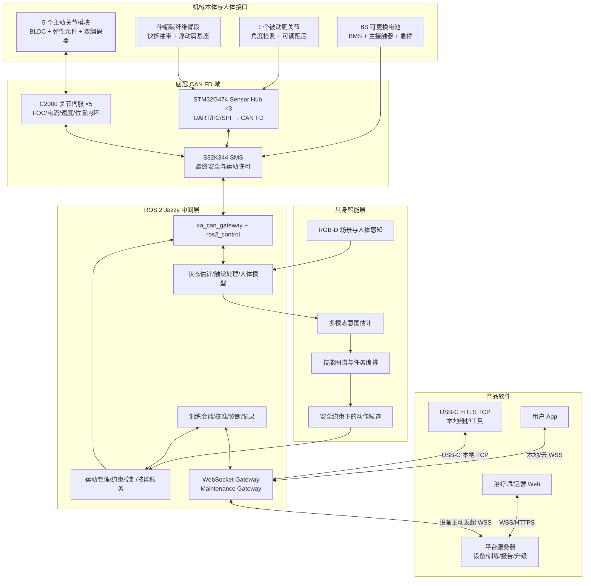

# 小A可穿戴具身智能系统架构与项目规划（待审阅，未正式发布）

> 版本：V2.2 单一方案  
> 日期：2026-09-07  
> 计划发布空间：飞书「小A创新创业」企业  
> 当前状态：已同步到飞书未共享任务清单，待负责人检查；未设置团队负责人/日期，未对团队正式发布  
> 飞书审阅入口：[小A可穿戴具身智能研发｜待检查](https://bcnto7mjaqvc.feishu.cn/next/task/task-lists/bc7ed287-280c-47b6-923c-86f084ae483c)  
> 代码仓库：[xiaoa-startup/xa-wearable-embodied-intelligence](https://github.com/xiaoa-startup/xa-wearable-embodied-intelligence)  
> 旧项目：[PSOC_E84_robot](https://github.com/HalloYang06/PSOC_E84_robot) 仅作为资产与经验来源，不约束新架构

## 0. 已确定的产品路线

首代产品定位为：**面向机构监督训练的轻量化上肢可穿戴具身智能设备**。不以“修复旧机械臂”为目标，而按商品重新设计机械、电源、控制、感知、ROS 2、平台和 App。

首代整机采用以下唯一架构：

- 5 个主动自由度：肩屈伸、肩外展内收、肩内外旋、肘屈伸、前臂旋前旋后。
- 1 个带角度检测的被动可调腕关节；不在前臂末端增加重型主动执行器。
- 每个主动关节一块本地伺服板，通过 CAN FD 接入安全与运动监督器。
- 三块分布式传感 Hub 靠近上臂、前臂和手部，传感器只走短距离 UART/I²C/SPI，Hub 再统一接 CAN FD；不把 I²C 拉过整条手臂。
- NXP S32K344 作为独立 Safety & Motion Supervisor（SMS），掌握急停、驱动使能、整机状态机和最终运动许可。
- Jetson Orin NX 16GB 以 15W 功耗档作为唯一中间计算平台，运行 Ubuntu、PREEMPT_RT、ROS 2 Jazzy、控制编排和具身智能。
- 中间软件模块之间只用 ROS 2；ROS 2 与底层硬件只通过 `ros2_control + xa_can_gateway` 访问 CAN FD。
- 用户 App 通过设备专用 Wi-Fi 本地 WSS 或平台 WSS 访问业务接口；BLE 只用于首次配网和设备发现。USB-C 本地维护口使用 mTLS TCP，仅在 SAFE 且驱动去使能时开放调试与校准。
- 首代取消肌电传感。使用他山三维力触觉单元/柔性触觉阵列做佩戴、接触、压力和切向力感知；关节交互力由弹性元件/关节扭矩估计负责。

### 0.1 对“触觉替代肌电”的修正

肌电和触觉不是可互换的传感器：肌电测神经肌肉激活，触觉测接触、压力、切向力、接近或材质等结果。他山公开资料目前描述的是三维力触觉、接近和多通道触觉特征，并非标准腕部六维力/力矩传感器。

本方案因此明确：

1. 首代不再宣称“肌电意图识别”。
2. 意图估计使用关节运动、交互力、IMU、触觉、训练任务和用户主动确认融合。
3. 他山触觉单元安装在上臂袖带、前臂袖带和手部握持区，负责佩戴检测、局部压力、滑移、接触方向和人机交互安全。
4. 肩、肘等主受力关节通过系列弹性元件形变量、电机电流和双编码器融合估计关节扭矩；触觉不能替代主受力链的扭矩观测。
5. 如果后续重新引入 EMG，应作为第二代新增需求和独立验证项目，而不是首代隐藏接口。

## 1. 总体系统架构



### 1.1 四条控制边界

1. 关节 C2000 本地执行 20 kHz 电流采样与 FOC、2 kHz 速度/扭矩环、1 kHz 位置环和硬件保护；上层不能发送 PWM。
2. SMS 以 1 kHz 执行整机安全状态机和关节许可，并通过独立硬件 Enable Loop 控制全部驱动器。
3. `ros2_control` 以 500 Hz 读取状态、生成有期限的参考；ROS 进程崩溃或参考过期时 SMS 停止助力并进入 SAFE/HOLD。
4. App、平台、WebSocket、TCP、视觉和 AI 均不能发送原始 CAN、电流、PWM 或绕过约束的关节命令。

## 2. 第一部分：机械重构

### 2.1 确定的机械方案

| 模块 | 单一设计决定 |
| --- | --- |
| 自由度 | 肩 3DOF + 肘 1DOF + 前臂旋转 1DOF 主动；腕屈伸 1DOF 被动可调、带角度检测 |
| 承载结构 | 上臂/前臂采用薄壁碳纤维伸缩管；关节座采用 7075-T6 铝合金；非受力外壳采用阻燃轻质工程塑料 |
| 长度调节 | 上臂、前臂各采用双导轨伸缩 + 弹簧销粗定位 + 偏心锁紧微固定；调节刻度可读且有防误松结构 |
| 肩部对齐 | 背部承力板 + 2DOF 被动浮动肩基座，允许肩胛运动补偿，避免将人体肩关节强制固定为理想球铰 |
| 执行器布局 | 大扭矩电机尽量布置在背部/近端；肘电机位于上臂近端；前臂旋转电机靠近肘部，减少远端惯量 |
| 传动 | 无刷电机 + 低背隙减速 + 系列弹性元件；弹性形变量用于扭矩估计与冲击缓冲 |
| 人体接口 | 上臂、前臂采用两片式快拆袖带和宽幅绑带；接触垫可拆洗；每个袖带设置触觉阵列检查压力和滑移 |
| 脱离 | 单手可操作机械快拆；断电不自锁在危险姿态；必要关节配置可控阻尼而非高保持制动 |
| 线束 | 24V 动力与信号分层走线；每个伸缩段使用受控弯曲余量、应力释放和锁紧连接器 |
| 左右适配 | 主承力件镜像，关节模块和电子板通用；不使用一套结构强行翻转装配 |

### 2.2 机械目标值（G1 评审后只能走变更流程）

- 手臂侧机械与执行器质量不超过 2.8 kg；腰背电池与计算单元不计入手臂侧质量。
- 整套穿戴质量不超过 5.0 kg；质量中心尽量靠近躯干。
- 单人穿戴时间不超过 3 分钟，脱卸不超过 60 秒，紧急机械脱离不超过 10 秒。
- 覆盖目标人群第 5–95 百分位的上臂长、前臂长和围度；调节后不得依赖软件补偿结构错位。
- 接触垫表面温度、局部压力、夹点、剪切和滑移有明确限值；限值由人因和风险评估冻结。
- 静载、峰值动态载荷、卡滞、跌落和急停工况均建立计算与实测安全系数。
- 关键关节寿命目标 100 万次基础循环；线束伸缩/弯折 20 万次；最终数值按实际工作谱修订。

### 2.3 机械任务包

| ID | 任务 | 完成定义 |
| --- | --- | --- |
| ME-001 | 测绘旧样机和人体接口问题 | 输出质量分解、尺寸、背隙、关节错位、夹点、穿戴步骤和失效照片 |
| ME-002 | 建立 5–95 百分位人体参数模型 | 上臂、前臂、肩宽、围度、ROM 和禁用姿态进入参数库 |
| ME-003 | 冻结 5 主动 + 1 被动关节轴线 | 人体模型、运动学、干涉和临床动作覆盖评审通过 |
| ME-004 | 设计浮动肩基座 | 验证肩胛补偿范围、承载、稳定性和快速脱离 |
| ME-005 | 设计两段可伸缩碳纤维臂 | 长度调节、防松、刻度、尺寸链和线束余量通过评审 |
| ME-006 | 完成两档标准关节模组 | 肩/肘大扭矩档与前臂小扭矩档接口统一 |
| ME-007 | 完成系列弹性与扭矩估计结构 | 刚度、迟滞、过载、疲劳和校准方案有数据 |
| ME-008 | 完成快拆袖带和接触垫 | 穿戴、清洁、压力分布和材料风险评估通过 |
| ME-009 | 完成机械硬限位与防夹设计 | 超行程、装反、调节错误和单故障不进入不可接受危险区 |
| ME-010 | 完成线束、接头和应力释放 | 全行程无拉扯、夹线、小弯曲半径和不可维护节点 |
| ME-011 | 完成 CAD、图纸、BOM、公差和紧固规范 | 受控版本可直接下单加工和检验 |
| ME-012 | 制造单关节、3DOF Alpha、完整 EVT | 每一代均有序列号、版本、装配偏差和测试记录 |
| ME-013 | 执行静载、背隙、刚度、热、噪声和寿命测试 | 达到冻结指标或形成批准的设计变更 |
| ME-014 | 执行形成性穿戴评估 | 穿脱、压力、对齐、滑移、误用和舒适性问题全部入台账 |

## 3. 第二部分：电源系统

### 3.1 确定的电源方案

- 单个可拆卸腰背电池包：6S1P 21700 锂离子，标称约 21.6V、4.0Ah、86Wh；单包低于 100Wh，便于做运输、存储和换电管理。
- 产品标配两个相同电池包，一次只装一个；不做带电热插拔，换电前设备进入 SAFE 并切断电机使能。
- 单包目标：在冻结的“标准机构训练工作谱”下不少于 90 分钟；两包合计不少于 3 小时。不对未定义的“典型工况”做续航承诺。
- 标准工作谱在 G1 前冻结：15W Orin 功耗档、指定关节扭矩/速度/占空比、连续感知、App 连接和 20% 容量老化裕量；高助力工况只按实测曲线标注可运行时间。
- 电池包包含双重过充/过放/过流/短路/过温保护、被动均衡、独立保险和带锁连接器。
- 24V 电机母线由电池直供并配置浪涌/再生能量钳位；12V 隔离电源供 Orin；5V/3.3V 低噪声电源供传感和逻辑。
- 主接触器/高边开关由 SMS 与硬件急停链共同控制；Linux 无法单独闭合主使能。
- 禁止穿戴或训练时充电；使用外置受控充电底座，充电与运行连接器物理区分。
- 取出电池时电机立即去使能；独立超级电容只维持 SMS/日志数秒完成故障记录，不继续驱动电机。

### 3.2 电源安全状态

| 状态 | 电机母线 | Orin/ROS | 允许动作 |
| --- | --- | --- | --- |
| OFF | 断开 | 断电 | 换电、运输 |
| CHARGE | 物理断开 | 断电 | 仅外置充电 |
| SAFE | 断开 | 可运行 | 诊断、配置读取、校准准备 |
| READY | 接触器闭合、驱动未使能 | 运行 | 自检、回零准备 |
| ACTIVE | 接触器闭合、按关节授权 | 运行 | 执行获批训练动作 |
| FAULT/ESTOP | 立即去使能；按风险决定母线断开 | 日志可短时运行 | 记录、机械脱离、人工复位 |

### 3.3 电源任务包

| ID | 任务 | 完成定义 |
| --- | --- | --- |
| PW-001 | 建立整机峰值/平均功率模型 | 关节、Orin、传感、通信、转换损耗和老化余量完整 |
| PW-002 | 确定 6S 86Wh 电芯和供应商 | 持续/峰值电流、循环、温度、追溯和认证资料满足要求 |
| PW-003 | 设计电池包、BMS、保险和锁紧外壳 | 单故障、反接、短路、跌落、误插和温升有控制 |
| PW-004 | 设计主接触器、急停和驱动 Enable Loop | 不依赖 Linux；最坏断开时序有示波器证据 |
| PW-005 | 设计 24V/12V/5V/3.3V 电源树 | 效率、纹波、隔离、浪涌、启动/关机时序通过评审 |
| PW-006 | 设计再生能量和过压处理 | 最坏减速/急停不损坏电池、母线或驱动 |
| PW-007 | 设计外置充电底座 | 运行和充电物理互斥，异常和温度保护通过 |
| PW-008 | 制作电子负载与电池仿真台架 | 可复现低电量、内阻上升、掉电、过流和 BMS 断开 |
| PW-009 | 执行续航、峰值、热和老化测试 | 新电池与寿命末期均达到声明或触发清晰降级 |
| PW-010 | 完成运输、存储、标签和回收要求 | 法规/物流资料和用户说明进入受控文档 |

## 4. 第三部分：外围传感器层

### 4.1 三块 Sensor Hub

每个 Hub 使用 STM32G474，具有唯一节点 ID、硬件时间戳、CAN FD、双镜像固件、看门狗和传感器 health。长线统一 CAN FD；I²C/SPI/UART 只在同一肢段、短于 20 cm 的局部线束内使用。

| Hub | 局部输入 | 通过 CAN FD 输出 |
| --- | --- | --- |
| `sensor_hub_torso` | 躯干 IMU、背板佩戴开关、急停辅助状态、环境温度 | 躯干姿态、佩戴状态、温度和 Hub health |
| `sensor_hub_upper_arm` | 上臂 IMU、上臂袖带他山触觉阵列、长度编码 | 上臂姿态、接触分布、滑移、伸缩参数和 health |
| `sensor_hub_forearm` | 前臂 IMU、前臂/手部他山触觉、被动腕角度 | 前臂姿态、接触/握持、腕角和 health |

### 4.2 传感器清单

| 传感器 | 数量 | 接口 | 采样/发布 | 用途 | 是否安全关键 |
| --- | ---: | --- | --- | --- | --- |
| 电机侧编码器 | 5 | SPI/ABI → 关节 C2000 | 20 kHz/1 kHz | 电机换相和速度 | 是 |
| 关节侧绝对编码器 | 5 | SPI → 关节 C2000 | 2 kHz/1 kHz | 关节位置、双编码器一致性 | 是 |
| 系列弹性形变/扭矩 | 5 | ADC/SPI → 关节 C2000 | 2 kHz/1 kHz | 交互扭矩和过载 | 是 |
| 电流/母线/驱动温度 | 每关节 | ADC/SPI → C2000 | 20 kHz/100 Hz | 保护、扭矩估计、热降额 | 是 |
| 6 轴 IMU | 3 | SPI → 对应 Hub | 400 Hz/200 Hz | 躯干/上臂/前臂姿态融合 | 否，安全辅助 |
| 他山三维力触觉阵列 | 3 区 | UART → 对应 Hub | 原始 200 Hz/ROS 100 Hz | 佩戴、压力、切向力、滑移、接触 | 否，安全辅助 |
| 被动腕角度 | 1 | I²C/SPI → 前臂 Hub | 200 Hz/100 Hz | 6DOF 人体状态建模 | 否 |
| 伸缩长度编码 | 2 | I²C/GPIO → Hub | 20 Hz/10 Hz | 自动更新运动学模型 | 否 |
| RGB-D 相机 | 1 | USB3 → Orin | 30 FPS | 人体、目标和训练环境感知 | 否 |
| 电池电压/电流/温度/SOC | 1 组 | SMBus/CAN → SMS | 10 Hz/2 Hz | 能量管理和告警 | 是 |

### 4.3 触觉处理规则

- Hub 输出带标定后的法向力、切向力、切向方向、接近值、原始通道、温度、质量分和饱和标志。
- ROS 侧计算袖带总压力、压力中心、区域最大值、滑移趋势和左右/前后不平衡。
- 触觉可触发“减小助力/暂停/提示重新穿戴”，但不能单独解除急停或授予运动许可。
- 任何传感器断线、数据陈旧、标定过期、饱和或温漂超限必须显式发布 `quality` 和 `fault_bits`，不能用零值伪装有效数据。

### 4.4 传感器任务包

| ID | 任务 | 完成定义 |
| --- | --- | --- |
| SE-001 | 向他山获取确定 SKU、机械图、原始串口协议、SDK 和商用授权 | 不以演示软件或 USB 转串口程序作为量产接口 |
| SE-002 | 设计三块通用 Sensor Hub | 原理图/PCB/BOM/固件通用，只靠节点配置区分位置 |
| SE-003 | 完成局部 UART/I²C/SPI 驱动 | 超时、CRC、重试、热插拔和错误码可测试 |
| SE-004 | 完成 CAN FD 时钟同步和时间戳 | 三 Hub 与 SMS/ROS 的端到端时间误差达到指标 |
| SE-005 | 建立触觉标定与温漂补偿 | 每区有序列号、标定版本、有效期和原始记录 |
| SE-006 | 实现佩戴/压力/滑移算法 | 假肢和人体形成性测试达到灵敏度/误报门槛 |
| SE-007 | 完成关节扭矩估计融合 | 弹性形变、电流和双编码器交叉验证，有失效降级 |
| SE-008 | 完成 IMU 标定与人体段姿态融合 | 躯干/上臂/前臂的静态和动态误差达到指标 |
| SE-009 | 完成 RGB-D 内参、外参和人体/目标坐标标定 | 置信度和失效状态进入 ROS，不输出假定位 |
| SE-010 | 执行 72 小时、弯折、汗液、温漂和断线恢复测试 | 无未解释丢帧、漂移、死锁和资源泄漏 |

## 5. 第四部分：底层 CAN FD 控制系统

### 5.1 节点与频率

| 节点 | 数量 | 控制器 | 本地职责 | CAN FD 周期 |
| --- | ---: | --- | --- | --- |
| SMS | 1 | NXP S32K344 | 整机安全状态、时间主站、许可、限位、故障锁存、黑匣子 | 1 kHz 主周期 |
| Joint Servo | 5 | TI TMS320F28P650 | FOC、位置/速度/扭矩内环、编码器和本地保护 | 1 kHz command/state |
| Sensor Hub | 3 | STM32G474 | 局部传感采集、标定、质量和 health | 100–200 Hz 数据，10 Hz health |
| Power/BMS | 1 | 独立 BMS + SMS 接口 | SOC、SOH、电流、温度、保护状态 | 10 Hz |
| Orin Gateway | 1 | SocketCAN | ROS 状态/有界参考与 CAN 映射 | 500 Hz reference/state |

总线固定为 CAN FD：仲裁段 1 Mbit/s、数据段 5 Mbit/s、29 位扩展 ID、64 字节最大载荷、双端 120Ω。动力与感知可使用两个物理 CAN FD 通道，由 SMS 桥接时间和安全状态；不是两套协议。

### 5.2 CAN ID 规划

29 位 ID：`priority[3] | class[5] | source[8] | destination[8] | subtype[5]`。数值越小优先级越高。

| Class | 数据 | 典型周期 | 规则 |
| --- | --- | ---: | --- |
| `0x00 SAFETY` | ESTOP、ENABLE、FAULT、HEARTBEAT | 1–10 ms | 最高优先；SMS 唯一可发全局 enable |
| `0x01 TIME` | 32 位 cycle、单调时间同步 | 1 ms | SMS 为唯一时间主站 |
| `0x02 JOINT_CMD` | mode、position、velocity、torque_limit、valid_until | 1 ms | 必须含序号、CRC、有效期；过期即拒绝 |
| `0x03 JOINT_STATE` | position、velocity、estimated_torque、fault | 1 ms | 每关节固定时隙上报 |
| `0x04 SENSOR` | IMU、触觉、腕角、长度 | 5–10 ms | 可分片；所有分片带同一采样时间 |
| `0x05 POWER` | voltage、current、SOC、temperature、protection | 100 ms | 低电量/过温事件改走 SAFETY |
| `0x06 CONFIG` | 参数读取、分段下载、提交、回滚 | 非周期 | 仅 SAFE 状态，版本和签名校验 |
| `0x07 DIAG` | health、统计、版本、黑匣子 | 100 ms/按需 | 不能改变运动权限 |
| `0x08 BOOT` | 固件升级、校验、A/B 切换 | 按需 | 仅维护模式，驱动硬件去使能 |

### 5.3 SMS 安全状态机

`OFF → BOOT → SELF_TEST → SAFE → READY → ARMED → ACTIVE`；任何状态可进入 `FAULT` 或 `ESTOP`。只有本地用户确认、全部关节/传感/电源满足条件、ROS 请求有效且 SMS 审核通过，才能从 READY 进入 ARMED。ACTIVE 每 1 ms 重新检查：

- 急停与硬件 Enable Loop；
- ROS heartbeat 与参考有效期；
- 每关节 heartbeat、模式、双编码器、位置、速度、估计扭矩、电流、温度；
- 电池、母线、看门狗、通信错误率；
- 用户 ROM、机械限位和当前训练模式界限；
- 关键佩戴状态；触觉异常触发降额/暂停，不作为唯一安全量。

### 5.4 CAN/固件任务包

| ID | 任务 | 完成定义 |
| --- | --- | --- |
| CAN-001 | 发布 CAN ICD V1 | ID、字节序、单位、比例、CRC、序号、时间、超时、版本和失败行为齐全 |
| CAN-002 | 计算最坏总线负载和时隙 | 两通道在所有周期/诊断/错误重发下保留至少 30% 余量 |
| SMS-001 | 制作 S32K344 SMS 板 | 含安全 PMIC、独立看门狗、双 CAN FD、以太网、急停和 Enable |
| SMS-002 | 实现启动自检和安全状态机 | 每个转换、守卫、超时、故障锁存和复位有测试 |
| SMS-003 | 实现 1 kHz 最终运动审核 | 每条 reference 都重新检查完整安全条件，不沿用旧许可 |
| SMS-004 | 实现黑匣子与安全参数双备份 | 记录故障前后数据；断电、CRC 错和版本冲突可恢复 |
| JS-001 | 制作两档 C2000 关节伺服板 | 功率级、编码器、弹性传感、温度、CAN 和硬件 enable 齐全 |
| JS-002 | 实现 FOC 和位置/速度/扭矩内环 | 台架性能、WCET、饱和、anti-windup 和保护通过 |
| JS-003 | 实现本地单故障保护 | 编码器矛盾、过流、过温、堵转、CAN 失联和 enable 丢失均安全 |
| FW-001 | 建立签名 A/B 固件升级 | 坏包、断电、降级和版本不兼容不会启动危险镜像 |
| FW-002 | 建立 SIL/HIL 故障注入 | 自动注入丢帧、乱序、陈旧、粘死、复位和电源异常 |
| FW-003 | 完成 72 小时总线与固件稳定性 | 无未解释复位、死锁、累计漂移和错误恢复失败 |

## 6. 第五部分：ROS 2 系统架构

### 6.1 运行基线

- Ubuntu 24.04 LTS + PREEMPT_RT，ROS 2 Jazzy，Cyclone DDS，SROS2 `Enforce`。
- Orin 固定 15W 功耗模式；控制容器使用隔离 CPU 核、锁内存和实时优先级。
- `controller_manager` 更新频率 500 Hz；唯一正式运动控制器 `xa_wearable_controller` 独占 5 轴 command interfaces，底层安全和关节闭环不依赖 ROS 实时性。
- 所有自研接口位于 `xa_interfaces`；禁止各包复制同名消息。
- 正式系统使用 LifecycleNode；按 `hardware → sensors → estimator → motion → skills → session → gateways` 顺序激活，反序关闭。
- 一个进程只进入一个 SROS2 enclave；默认拒绝未授权 topic/service/action。

ROS 官方边界沿用：Topic 传连续流，Service 处理立即完成的短请求，Action 承担可取消、带反馈的长任务。轨迹执行采用标准 `control_msgs/action/FollowJointTrajectory`，不使用 fire-and-forget trajectory topic 作为正式入口。

### 6.2 ROS 2 包与节点

| 包 | 节点 | 职责 |
| --- | --- | --- |
| `xa_interfaces` | 无 | 统一 msg/srv/action 和语义版本 |
| `xa_description` | `robot_state_publisher` | URDF、关节、伸缩参数、TF 和 ros2_control 描述 |
| `xa_can_gateway` | `xa_can_system` hardware plugin | SocketCAN、CAN ICD、时间同步、状态/命令映射 |
| `xa_control` | `controller_manager`、`joint_state_broadcaster`、`xa_wearable_controller` | 500 Hz 硬件读写；唯一占有命令接口；轨迹/阻抗/助力模式和受检参考生成 |
| `xa_safety` | `safety_bridge` | SMS 状态、运动许可、故障和 ROS heartbeat；无权自行放行 |
| `xa_sensor_hub` | `sensor_bridge` | 三个 Hub 的 IMU、触觉、腕角、长度和 health |
| `xa_tactile` | `tactile_processor` | 压力中心、滑移、佩戴质量和接触状态 |
| `xa_state_estimation` | `body_state_estimator` | 躯干/上臂/前臂姿态、关节/力融合和质量 |
| `xa_motion` | `motion_coordinator`、`constraint_monitor` | 任务空间目标、重力补偿、人体模型、QP 约束盾和控制器模式编排；不直接占有硬件接口 |
| `xa_skills` | `skill_server` | 回零、保持、跟随、到达、重复、助力、停止技能 |
| `xa_training` | `training_session_server` | 训练程序、阶段、次数、暂停、指标和结果 |
| `xa_calibration` | `calibration_server` | 穿戴、零位、ROM、触觉、扭矩和伸缩参数校准 |
| `xa_perception` | `rgbd_perception`、`intent_estimator` | RGB-D、人体/目标、多模态意图与置信度 |
| `xa_diagnostics` | `diagnostic_aggregator`、`self_test_server` | 诊断、统计、自检和故障快照 |
| `xa_recording` | `session_recorder` | rosbag2/MCAP、统一元数据、回放和证据索引 |
| `xa_gateway` | `ws_gateway`、`maintenance_gateway` | 白名单 WSS 与本地 mTLS TCP，不做通用 ROS bridge |
| `xa_bringup` | `lifecycle_orchestrator` | 启动门禁、依赖、恢复和关闭顺序 |

### 6.3 Topic 清单

命名空间固定为 `/xa`。正式产品中 `xa_wearable_controller` 是唯一占有 5 轴 command interfaces 的控制器。`/xa/motion/reference` 是该控制器发布的只读遥测，不是命令入口；硬件插件也不接受任何 ROS Topic 命令。

| Topic | 类型 | 频率 | Publisher → Subscriber | QoS |
| --- | --- | ---: | --- | --- |
| `/xa/joint_states` | `sensor_msgs/msg/JointState` | 500 Hz | joint_state_broadcaster → estimator/motion/recorder | `SENSOR_FAST` |
| `/xa/joints/detail` | `xa_interfaces/msg/JointArrayState` | 100 Hz | xa_can_system → safety/diagnostics/recorder | `CONTROL_STATE` |
| `/xa/safety/state` | `xa_interfaces/msg/SafetyState` | 100 Hz | safety_bridge → all control/gateway/UI nodes | `SAFETY_STATE` |
| `/xa/power/state` | `sensor_msgs/msg/BatteryState` | 2 Hz | safety_bridge → diagnostics/gateway | `STATE_RELIABLE` |
| `/xa/sensors/imu/torso` | `sensor_msgs/msg/Imu` | 200 Hz | sensor_bridge → estimator | `SENSOR_FAST` |
| `/xa/sensors/imu/upper_arm` | `sensor_msgs/msg/Imu` | 200 Hz | sensor_bridge → estimator | `SENSOR_FAST` |
| `/xa/sensors/imu/forearm` | `sensor_msgs/msg/Imu` | 200 Hz | sensor_bridge → estimator | `SENSOR_FAST` |
| `/xa/sensors/tactile/upper_arm` | `xa_interfaces/msg/TactileArray` | 100 Hz | sensor_bridge → tactile_processor/recorder | `SENSOR_FAST` |
| `/xa/sensors/tactile/forearm` | `xa_interfaces/msg/TactileArray` | 100 Hz | sensor_bridge → tactile_processor/recorder | `SENSOR_FAST` |
| `/xa/sensors/tactile/hand` | `xa_interfaces/msg/TactileArray` | 100 Hz | sensor_bridge → tactile_processor/recorder | `SENSOR_FAST` |
| `/xa/sensors/wrist_angle` | `sensor_msgs/msg/JointState` | 100 Hz | sensor_bridge → estimator | `SENSOR_FAST` |
| `/xa/sensors/link_lengths` | `xa_interfaces/msg/LinkLengths` | 10 Hz/变化即发 | sensor_bridge → description/estimator | `CONFIG_LATCHED` |
| `/xa/contact/state` | `xa_interfaces/msg/ContactState` | 100 Hz | tactile_processor → safety/motion/gateway | `CONTROL_STATE` |
| `/xa/body/state` | `xa_interfaces/msg/BodyState` | 100 Hz | estimator → motion/skills/recorder | `CONTROL_STATE` |
| `/xa/perception/human_state` | `xa_interfaces/msg/HumanState` | 30 Hz | rgbd_perception → intent_estimator/recorder | `SENSOR_FAST` |
| `/xa/intent/state` | `xa_interfaces/msg/IntentState` | 20 Hz | intent_estimator → skill_server/recorder | `STATE_RELIABLE` |
| `/xa/ai/model_state` | `xa_interfaces/msg/ModelState` | 1 Hz/变化即发 | intent_estimator → diagnostics/gateway/recorder | `CONFIG_LATCHED` |
| `/xa/perception/objects` | `vision_msgs/msg/Detection3DArray` | 30 Hz | rgbd_perception → skills/recorder | `SENSOR_FAST` |
| `/xa/motion/constraints` | `xa_interfaces/msg/ConstraintState` | 100 Hz | constraint_monitor → motion/safety/gateway | `CONTROL_STATE` |
| `/xa/motion/reference` | `xa_interfaces/msg/BoundedJointReference` | 500 Hz | xa_wearable_controller → safety/diagnostics/recorder | `SENSOR_FAST` |
| `/xa/motion/controller_state` | `control_msgs/msg/JointTrajectoryControllerState` | 100 Hz | xa_wearable_controller → motion/recorder | `CONTROL_STATE` |
| `/xa/skill/state` | `xa_interfaces/msg/SkillState` | 20 Hz | skill_server → training/gateway | `STATE_RELIABLE` |
| `/xa/training/state` | `xa_interfaces/msg/TrainingState` | 10 Hz | training_session_server → gateway/recorder | `STATE_RELIABLE` |
| `/xa/training/metrics` | `xa_interfaces/msg/TrainingMetrics` | 1 Hz | training_session_server → gateway/recorder | `STATE_RELIABLE` |
| `/xa/calibration/state` | `xa_interfaces/msg/CalibrationState` | 5 Hz/变化即发 | calibration_server → gateway | `CONFIG_LATCHED` |
| `/xa/diagnostics` | `diagnostic_msgs/msg/DiagnosticArray` | 1 Hz/故障即发 | diagnostic_aggregator → gateway/recorder | `EVENT_RELIABLE` |
| `/xa/events` | `xa_interfaces/msg/DeviceEvent` | 事件 | all approved nodes → gateway/recorder | `EVENT_RELIABLE` |
| `/xa/recording/status` | `xa_interfaces/msg/RecordingStatus` | 1 Hz | session_recorder → diagnostics/gateway | `STATE_RELIABLE` |
| `/tf` | `tf2_msgs/msg/TFMessage` | 50–200 Hz | state publishers → all | ROS dynamic TF QoS |
| `/tf_static` | `tf2_msgs/msg/TFMessage` | 变更即发 | robot_state_publisher → all | transient local |
| `/statistics` | `statistics_msgs/msg/MetricsMessage` | 1 Hz | enabled subscriptions → diagnostics | reliable |

### 6.4 QoS 固定配置

| 名称 | Reliability | History/depth | Durability | Deadline/Lifespan |
| --- | --- | --- | --- | --- |
| `SENSOR_FAST` | best effort | keep last 5 | volatile | lifespan 100 ms |
| `CONTROL_STATE` | reliable | keep last 3 | volatile | deadline 20 ms；miss 进入诊断 |
| `SAFETY_STATE` | reliable | keep last 1 | volatile | deadline 20 ms，liveliness lease 50 ms |
| `CONTROL_COMMAND` | reliable | keep last 1 | volatile | deadline 4 ms，lifespan 10 ms |
| `STATE_RELIABLE` | reliable | keep last 10 | volatile | 无强制 deadline |
| `EVENT_RELIABLE` | reliable | keep last 100 | transient local | 事件不得静默丢弃 |
| `CONFIG_LATCHED` | reliable | keep last 1 | transient local | 新节点启动可获得最后有效配置 |

### 6.5 Service 清单

Service 只处理可在 500 ms 内完成的查询或原子状态变更；校准、运动、自检和升级一律使用 Action。

| Service | 类型 | 调用者 | 行为与限制 |
| --- | --- | --- | --- |
| `/xa/system/get_capabilities` | `xa_interfaces/srv/GetCapabilities` | App/Web/诊断 | 返回硬件、DOF、技能、协议和版本，只读 |
| `/xa/system/get_state` | `xa_interfaces/srv/GetSystemState` | gateway/诊断 | 返回 ROS、SMS、关节、传感和电源汇总，只读 |
| `/xa/system/request_mode` | `xa_interfaces/srv/RequestMode` | training/calibration | 只允许请求 SAFE/READY；ARMED/ACTIVE 由 Action + 本地确认驱动 |
| `/xa/system/reset_fault` | `xa_interfaces/srv/ResetFault` | 本地 App/维护工具 | 仅故障原因消失、物理确认有效、设备静止时接受 |
| `/xa/power/request_shutdown` | `xa_interfaces/srv/RequestShutdown` | App/网关 | 先取消 Action、进入 SAFE、刷写日志，再关闭 Orin |
| `/xa/config/get_schema` | `xa_interfaces/srv/GetConfigSchema` | 维护工具 | 返回参数类型、范围、单位、是否安全相关和版本 |
| `/xa/config/get_snapshot` | `xa_interfaces/srv/GetConfigSnapshot` | 维护工具/诊断 | 只读当前生效配置和 hash |
| `/xa/config/stage` | `xa_interfaces/srv/StageConfig` | maintenance_gateway | 暂存配置；不立即生效；只在 SAFE 接受 |
| `/xa/config/validate` | `xa_interfaces/srv/ValidateConfig` | maintenance_gateway | 做范围、交叉约束、版本和签名校验 |
| `/xa/config/commit` | `xa_interfaces/srv/CommitConfig` | maintenance_gateway | 需要二次确认；生成审计记录；必要时要求重启 |
| `/xa/config/rollback` | `xa_interfaces/srv/RollbackConfig` | maintenance_gateway | 回退到上一个签名快照 |
| `/xa/skills/list` | `xa_interfaces/srv/ListSkills` | App/Web/training | 返回获批技能、前置条件、参数范围和版本 |
| `/xa/training/list_programs` | `xa_interfaces/srv/ListPrograms` | App | 返回已同步到本地且适用于当前用户配置的训练程序 |
| `/xa/calibration/get_profile` | `xa_interfaces/srv/GetCalibrationProfile` | training/维护工具 | 返回版本、有效期和质量，不返回无权限敏感数据 |
| `/xa/diagnostics/get_snapshot` | `xa_interfaces/srv/GetDiagnosticSnapshot` | gateway/维护工具 | 返回当前 health、计数器和版本 |
| `/xa/recording/mark_event` | `xa_interfaces/srv/MarkEvent` | App/training/测试 | 在统一时间线记录用户标记、症状或实验事件 |

### 6.6 Action 清单

| Action | 类型 | Goal | Feedback | Result/取消行为 |
| --- | --- | --- | --- | --- |
| `/xa/homing/run` | `xa_interfaces/action/HomeRobot` | joints、速度上限、torque_limit | 当前关节、阶段、进度 | 返回每轴零位质量；取消时受控减速并 SAFE |
| `/xa/calibration/run` | `xa_interfaces/action/CalibrateRobot` | `profile_id`、scope（fit/zero/rom/tactile/torque/all） | 当前步骤、用户提示、质量、进度 | 返回签名 profile；失败不覆盖旧配置 |
| `/xa/motion/follow_joint_trajectory` | `control_msgs/action/FollowJointTrajectory` | 5 个主动关节完整轨迹、容差 | desired/actual/error | `xa_wearable_controller` 内部 Action；取消时按减速度停止；不对 WSS/TCP 暴露 |
| `/xa/motion/move_to_pose` | `xa_interfaces/action/MoveToPose` | target、速度/力/ROM 约束、有效期 | 当前位姿、约束余量、进度 | IK/约束失败立即终止；不降级成裸轨迹 |
| `/xa/skills/execute` | `xa_interfaces/action/ExecuteSkill` | skill_id、session_id、参数、assist_level、次数 | phase、progress、safety_margin、用户提示 | 结果含完成原因和指标；取消进入受控停止 |
| `/xa/training/run` | `xa_interfaces/action/RunTrainingSession` | program_id、profile_id、session_id | 当前技能、组/次、进度、疼痛/暂停提示 | 生成会话摘要；App 只调用此 Action |
| `/xa/diagnostics/run_self_test` | `xa_interfaces/action/RunSelfTest` | level（quick/full/service） | 当前组件、进度、发现项 | full/service 仅 SAFE；输出签名报告 |
| `/xa/maintenance/update_bundle` | `xa_interfaces/action/UpdateBundle` | 签名 manifest、组件、版本 | 下载/校验/安装/重启进度 | 失败回滚；任何执行器升级均要求 SAFE + 外接电源 |

### 6.7 核心自定义消息字段

所有消息带 `std_msgs/Header header`、`uint16 schema_version`、`uint32 sequence` 和来源 ID；跨边界不得用无结构 JSON 替代。

```text
SafetyState:
  state, motion_allowed, estop_active, enable_loop_ok,
  active_fault_bits, latched_fault_bits, allowed_modes,
  command_age_ms, joint_state_age_ms, reason_code, reason_text

JointArrayState / JointStateDetail[]:
  name, position_rad, velocity_rad_s, estimated_torque_nm,
  motor_current_a, motor_temp_c, driver_temp_c, bus_voltage_v,
  control_mode, calibration_valid, fault_bits, state_age_us

TactileArray / TactileCell[]:
  frame_id, calibration_id, quality, saturated, proximity_m,
  normal_force_n, tangential_force_n, tangential_direction_rad,
  raw_channels[], temperature_c, fault_bits

BoundedJointReference:
  reference_id, source_action_id, mode, valid_until,
  joint_names[], position_rad[], velocity_rad_s[],
  feedforward_torque_nm[], torque_limit_nm[], stiffness[], damping[]

BodyState:
  profile_id, fit_quality, kinematic_quality,
  joint_names[], position/velocity/estimated_torque,
  torso/upper_arm/forearm poses, link_lengths, user_rom_margin[]

IntentState:
  intent_id, confidence, source_mask, observation_quality,
  target_frame, target_pose, requested_skill, valid_until

HumanState:
  tracking_id, tracking_quality, keypoints_3d[], target_objects[],
  occlusion_bits, workspace_zone, source_frame, observation_age_ms

ModelState:
  model_id, semantic_version, artifact_hash, dataset_version,
  runtime, precision, inference_latency_ms_p50/p99,
  input_health_bits, ood_score, degraded, fault_bits
```

### 6.8 ROS 系统任务包

| ID | 任务 | 完成定义 |
| --- | --- | --- |
| ROS-001 | 创建 `xa_interfaces` | 本节所有 msg/srv/action 可生成 C++/Python/TypeScript schema |
| ROS-002 | 实现 `xa_can_system` ros2_control hardware plugin | 500 Hz read/write、超时、错误恢复和统计通过 HIL |
| ROS-003 | 实现 `xa_wearable_controller` 并独占 5 轴 command interfaces | 轨迹/阻抗/助力模式、容差、取消、降速、命令有效期和无双命令源通过 HIL |
| ROS-004 | 实现生命周期编排 | 启动/关闭/错误恢复顺序可自动验证 |
| ROS-005 | 实现 safety_bridge | SMS 状态与 ROS 语义一致；绝不自行产生 motion_allowed |
| ROS-006 | 实现 sensor/tactile/state estimator | 时间同步、质量传播、陈旧数据和降级明确 |
| ROS-007 | 实现 constraint_monitor、QP 约束盾和 bounded reference | ROM、关节、速度、扭矩、接触和有效期全部检查；约束无解时受控停止 |
| ROS-008 | 实现技能和训练 Action Server | 取消、抢占、暂停、恢复、反馈和结果语义统一 |
| ROS-009 | 实现校准 Action 与 profile 管理 | 旧配置不被失败校准覆盖，配置有 hash/签名/版本 |
| ROS-010 | 实现诊断、统计、MCAP 记录和确定性回放 | 同一记录可重放到 SIL/HIL，消息年龄和周期可分析 |
| ROS-011 | 建立 SROS2 enclave 与最小权限 | 未授权节点不能发布 reference、调用 config 或伪造 safety |
| ROS-012 | 建立 CI、SIL、HIL 和接口兼容测试 | IDL 破坏性变化、QoS 不匹配、超时和生命周期错误自动阻断 |

## 7. 第六部分：具身智能、数据与模型

### 7.1 首代具身智能的产品定义

首代不做“大模型端到端控电机”。具身智能的确定闭环是：**感知身体、人机接触和环境 → 估计用户当前意图 → 从受控技能库选择行为 → 生成有界参数 → 确定性约束层和 SMS 放行 → 动作后再感知与调整**。

模型只能输出语义意图、`skill_id`、目标位姿和受限参数，不能输出 PWM、电流、原始 CAN 帧或未经约束的关节轨迹。运动许可仍由本地用户确认、`xa_wearable_controller` 和 SMS 三层共同决定。

### 7.2 唯一技术链

| 层 | 固定实现 | 输入 | 输出 | 故障行为 |
| --- | --- | --- | --- | --- |
| 时空感知 | RGB-D + 三 IMU + 关节/扭矩 + 三区触觉，全部统一时间戳 | 原始传感和标定 | `HumanState`、`BodyState`、`ContactState` | 降低 quality，不用历史值伪装实时数据 |
| 意图估计 | 时序多模态融合网络，TensorRT FP16 端侧推理 | 身体、接触、人体追踪、当前训练阶段 | `NO_INTENT/ASSIST_INITIATION/CONTINUE_REPETITION/PAUSE_REQUEST/STOP_REQUEST/TARGET_REACH` + 置信度 | 低置信、输入缺失或 OOD 时输出 `NO_INTENT` |
| 技能编排 | 签名版本化技能图 + 确定性状态机 | 意图、处方、用户 profile、训练上下文 | 获批 `skill_id` 和有界参数 | 前置条件不满足即拒绝，不自动换技能 |
| 动作生成 | Pinocchio 人机运动学/动力学 + OSQP 约束优化 | 目标、ROM、速度、扭矩、接触和适配质量 | 500 Hz 有效期 bounded reference | QP 无解或超时时受控减速并进入 HOLD/SAFE |
| 学习闭环 | 离线训练、离线回放、SIL/HIL、签名发布 | 去标识化会话数据和失败标签 | 新模型包和评估报告 | 量产设备不在线更新模型权重 |

### 7.3 数据闭环与模型门禁

- 设备本地以 MCAP 记录经批准的高频信号，每次会话绑定样机、软硬件、模型、技能、用户 profile 和校准版本。
- 默认上传会话摘要和质量指标；原始 RGB-D、触觉和人体数据需单独知情同意、去标识化和存储期策略。
- 标注对象固定为意图、动作阶段、接触、中止原因、误报/漏报、数据质量和故障；不把“疼痛”作为纯传感器自动推断标签，疼痛只来自用户主动报告。
- 数据集按人分组，同一使用者不能同时进入训练集和测试集；主结果报告使用未参与训练的用户、场景和设备留出集。
- 模型放行必须同时通过：语义意图指标、低置信/OOD 拒绝、p99 时延、连续 72 小时运行、回放回归、失效降级、签名/回滚和人机可用性。
- 性能门槛在 G0 冻结：端到端意图推理 p99 不超过 50 ms；未经本地确认的自主运动启动次数必须为 0；其余准确率、拒绝率和人群分层门槛由形成性数据冻结，不用小样本演示结果代替。

### 7.4 具身智能任务包

| ID | 任务 | 完成定义 |
| --- | --- | --- |
| AI-001 | 冻结首代意图本体、技能库和禁止行为 | 每个意图的输入证据、前置、超时、拒绝和可观测结果完整 |
| AI-002 | 建立人机身体模型与 Pinocchio 参数化 | 5+1 DOF、伸缩长度、人体 ROM、重力和接触坐标可重复校准 |
| AI-003 | 实现 RGB-D 人体/目标感知 | 输出时间戳、置信度、遮挡和工作区；失败不产生假目标 |
| AI-004 | 建立多模态数据协议、采集工具和标注手册 | 数据权限、版本、完整性、质量、去标识化和同意可审计 |
| AI-005 | 先实现无学习确定性基线 | 所有技能在无 AI 时可安全执行，用作模型收益对照和降级模式 |
| AI-006 | 训练时序多模态意图模型 | 按人/设备/场景留出评估，输出置信度、OOD 和有效期 |
| AI-007 | 实现签名技能图与状态机 | 无效转移、重复命令、超时、取消和低置信度均有确定结果 |
| AI-008 | 实现 OSQP 约束动作生成 | 500 Hz 最坏执行时间、无解退出、ROM/扭矩/速度/接触约束通过 HIL |
| AI-009 | 完成 TensorRT FP16 端侧部署 | 在 Orin 15W 模式下达到 p99 时延、内存、温升和 72 小时稳定性门槛 |
| AI-010 | 建立离线回放、对抗失效和公平性评估 | 遮挡、传感器偏置、网络断开、不同体型/能力的差异进入回归集 |
| AI-011 | 建立模型注册、签名、兼容和回滚 | 只能安装通过门禁的模型；模型与 ROS/skill/profile 兼容可机械校验 |
| AI-012 | 执行机构监督试点与闭环改进 | 每轮只基于预注册指标放行，失败案例回到风险、数据和测试库 |

## 8. 第七部分：WebSocket、TCP、平台与 App

### 8.1 WSS 架构

设备只主动向平台建立出站连接：`wss://api.xiao-a.example/v1/device/ws`。设备配置 Wi-Fi 6 + BLE 5.2 M.2 模块：BLE 只负责发现、配网和一次性绑定，不传运动命令；用户 App 训练时优先经设备专用 WPA3 Wi-Fi 连接本地 WSS：`wss://192.168.50.1/v1/app/ws`。USB-C 维护网络使用独立子网 `192.168.55.0/24`，不与 App 通道复用。互联网场景只同步计划和结果，不能远程启动机械运动。

WSS 不做“ROS topic 全量转发”。`ws_gateway` 只映射白名单业务事件和 Action/Service，避免平台协议绑死 ROS 内部结构。

统一 JSON envelope：

```json
{
  "v": 1,
  "id": "uuid",
  "type": "training.state",
  "device_id": "XA-000001",
  "session_id": "opaque-id",
  "seq": 1024,
  "ts": "2026-09-07T12:00:00.123Z",
  "reply_to": null,
  "payload": {}
}
```

### 8.2 WSS 白名单

| 方向 | type | 频率/触发 | 说明 |
| --- | --- | --- | --- |
| Device → App/Cloud | `device.hello` | 连接时 | 型号、能力、软硬件/协议版本 |
| Device → App/Cloud | `device.state` | 1 Hz/变化 | SAFE/READY/ACTIVE/FAULT 等业务状态 |
| Device → App/Cloud | `power.state` | 0.5 Hz | SOC、续航估算、温度和是否需换电 |
| Device → App | `fit.state` | 10 Hz | 袖带佩戴、压力/滑移摘要；原始触觉不上云 |
| Device → App/Cloud | `training.state` | 5 Hz | 当前动作、组次、进度、暂停原因 |
| Device → App/Cloud | `training.metrics` | 1 Hz | ROM、完成度、主动参与度、助力摘要 |
| Device → App/Cloud | `safety.event` | 立即 | 故障、急停、拒绝和用户提示；必须 ACK |
| Device → Cloud | `session.completed` | 会话结束 | 签名摘要、记录索引、软件/模型/校准版本 |
| Device → Cloud | `diagnostic.summary` | 1/60 Hz/异常 | health、计数器和维护建议 |
| App → Device | `training.start` | 用户操作 | 网关转为 `/xa/training/run`；必须本地、设备 READY、长按确认 |
| App → Device | `training.pause/resume/cancel` | 用户操作 | 映射 Action 控制；cancel 为受控停止，不是急停 |
| App → Device | `calibration.start` | 用户操作 | 只允许 fit/zero/ROM 用户校准，不开放工程参数 |
| App → Device | `event.mark` | 用户操作 | 疼痛、不适、困难等标记进入时间线 |
| Cloud → Device | `program.sync` | 变更 | 同步已批准训练程序；不能直接开始运行 |
| Cloud → Device | `update.offer` | 变更 | 提供签名 manifest；设备在维护窗口自行决定下载 |
| Cloud → Device | `diagnostic.request` | 按需 | 只请求白名单摘要，不取原始个人数据 |

### 8.3 本地 TCP 维护口

- 物理接口：USB-C Ethernet Gadget，设备固定地址 `192.168.55.1`，TCP 端口 `7443`。
- 安全：双向 TLS 1.3，维修电脑证书、设备证书和角色权限；端口默认关闭。
- 开启条件：设备物理维护开关有效、状态为 SAFE、主驱动 Enable Loop 断开；15 分钟无活动自动关闭。
- 协议：4 字节长度前缀 + Protobuf `MaintenanceEnvelope`，包含 version、request_id、type、timestamp、payload、hash。
- 审计：每次连接、读取、暂存、验证、提交、回滚和校准都记录操作者证书、设备序列号、前后配置 hash 和结果。

允许命令只有：

1. `GetInventory`、`GetHealth`、`GetLogs`、`GetBlackbox`。
2. `GetConfigSchema`、`GetConfigSnapshot`、`StageConfig`、`ValidateConfig`、`CommitConfig`、`RollbackConfig`。
3. `RunSelfTest`、`RunCalibration`、`UpdateBundle`、`ExportEvidence`。
4. 工程校准运动只能调用受限 `RunCalibration` Action，要求本地机械使能按钮持续按住，并使用固化低速/低扭矩上限。

明确禁止：原始 CAN 透传、任意 ROS topic 发布、PWM/电流直控、关闭安全检查、远程解除急停、云服务器直连 7443。

### 8.4 用户 App

App 面向佩戴者，不混入工程调试页面。治疗师处方、机构运营和设备批量管理放在 Web 平台。

| App 页面 | 功能 | 安全限制 |
| --- | --- | --- |
| 登录/设备绑定 | 账户、扫码绑定、BLE 配网、设备所有权和离线凭证 | BLE 不传运动命令，App 不保存维护证书 |
| 穿戴向导 | 图文/动画步骤、袖带触觉压力、滑移和对齐检查 | 佩戴质量不足不能开始训练 |
| 快速校准 | 零位、舒适 ROM、身体尺寸、疼痛边界 | 结果必须经设备范围校验 |
| 今日训练 | 读取治疗师已批准计划，显示预计时间和强度 | 用户不能自定义裸轨迹或工程参数 |
| 训练中 | 动作、组次、节奏、助力、语音/震动提示、暂停/取消 | 开始需本地长按；急停仍是物理按钮 |
| 状态与电量 | 电量、预计续航、连接、佩戴、温度和故障提示 | 只显示可操作的用户语言，不暴露原始错误码 |
| 训练报告 | ROM、完成度、参与度、趋势和主观反馈 | 不做未经验证的疾病诊断或疗效承诺 |
| 帮助与售后 | 清洁、换电、故障排查、联系机构、隐私与数据导出 | 高风险故障直接停止使用并联系服务 |

### 8.5 平台与 App 任务包

| ID | 任务 | 完成定义 |
| --- | --- | --- |
| GW-001 | 定义 WSS envelope、认证、ACK、重连和幂等语义 | 网络抖动、重复、乱序和离线缓存有测试 |
| GW-002 | 实现 ROS→WSS 白名单适配 | 无通用 topic bridge；每个 type 有权限、频率和数据最小化规则 |
| GW-003 | 实现 WSS→Service/Action 映射 | 非本地请求不能启动运动；Action 状态与 WSS 一致 |
| GW-004 | 实现 USB-C mTLS TCP 维护网关 | 开关、SAFE、证书、超时和审计全部生效 |
| GW-005 | 实现配置 stage/validate/commit/rollback | 参数越界、组合冲突、断电和版本回滚通过测试 |
| APP-001 | 完成 App 信息架构和关键任务原型 | 佩戴、校准、训练、暂停、换电和故障流程完成可用性评审 |
| APP-002 | 实现 BLE 发现/配网、绑定和 Wi-Fi WSS | 首次配置、离线、换手机、证书更新、解绑和 App/维护子网隔离可测试 |
| APP-003 | 实现穿戴与校准向导 | 触觉/姿态质量实时提示，失败有明确修正动作 |
| APP-004 | 实现训练会话 Action 客户端 | 开始、反馈、暂停、恢复、取消和异常恢复完整 |
| APP-005 | 实现报告、主观反馈和隐私控制 | 本地/云一致，导出和删除权限正确 |
| WEB-001 | 实现治疗师计划与用户参数管理 | 只能编辑获批范围；变更有版本和审计 |
| WEB-002 | 实现设备、版本、诊断和试点运营 | 设备不能从 Web 被远程启动运动 |
| CLOUD-001 | 实现设备身份、会话、异步上传和签名升级 | 最小权限、速率限制、断点续传和防重放通过 |
| SEC-001 | 完成 App/WSS/TCP/API 威胁模型与渗透测试 | 高危问题清零，密钥轮换和撤销演练通过 |

## 9. 集成、验证与商品化门禁

| 门禁 | 周期 | 核心交付物 | 必须关闭的条件 |
| --- | --- | --- | --- |
| G0 架构冻结 | W0–W4 | 产品定义、本文架构、预算、风险、供应商接口 | 不再存在主控/总线/DOF/传感/协议方向争议 |
| G1 单关节与电源 PoC | W5–W12 | 两档关节台架、SMS、Sensor Hub、电池、CAN、ROS 骨架 | 扭矩/热/噪声/急停/时延/续航达到门槛 |
| G2 3DOF Alpha | W13–W22 | 肩/肘半臂、App Alpha、技能/校准/触觉闭环 | 无人体→假人→低能量人体逐级通过 |
| G3 完整 EVT | W23–W34 | 5 主动 + 1 被动完整形态、5–8 台 EVT | 全链路故障注入、佩戴、72h、技能和报告通过 |
| G4 DVT/设计冻结 | W35–W44 | 10–15 台 DVT、需求追踪、可靠性和合规预测试 | P0 风险清零，EMC/安规/可用性差距有结论 |
| G5 PVT/试点准备 | W45–W52 | 20–50 台 PVT、EOL、追溯、培训、售后 | 良率、版本、残余风险和机构试点共同放行 |

### 9.1 全系统 P0 验证

- 物理急停、Enable Loop、CAN 中断、ROS 崩溃、Orin 重启、reference 过期和关节故障的最坏停止时间/距离。
- 双编码器不一致、扭矩传感漂移、触觉掉线、IMU 跳变、BMS 断开、低电量和过温降级。
- 伸缩长度或袖带位置错误时，运动学/ROM 校验能阻止不安全动作。
- App/WSS 重复命令、断线重连、云端伪造、TCP 非法证书、参数越界和升级断电。
- 训练 Action 的取消、暂停、抢占和技能切换不会留下旧 reference。
- 所有测试证据绑定样机序列号、BOM、硬件、固件、ROS、App、模型、校准和原始数据版本。

## 10. 飞书规划结构

### 10.1 知识库目录

```text
小A可穿戴具身智能项目
├── 00｜项目主页、产品定义和使用说明
├── 01｜机械重构
├── 02｜电池、电源和安全硬件
├── 03｜外围传感器与他山触觉
├── 04｜CAN FD、SMS 和关节伺服
├── 05｜ROS 2 架构、接口和技能
├── 06｜WebSocket、TCP、平台与 App
├── 07｜具身智能、数据和模型评估
├── 08｜系统集成、测试与缺陷
├── 09｜质量、法规、风险与网络安全
├── 10｜BOM、供应链、试产和售后
├── 11｜版本、变更与发布
└── 📊 项目总控（多维表格）
```

### 10.2 多维表格

1. `✅ WBS 任务管理`：本文各部分任务、父子关系、依赖、负责人、计划、完成定义和证据。
2. `📝 周进展与实验记录`：实验条件、原始数据、结论、失败、阻塞和下一步。
3. `🎯 里程碑与门禁`：G0–G5 入口/出口、材料、结论和未关闭项。
4. `📐 系统需求与追踪`：用户需求 → 系统/子系统需求 → 风险 → 设计 → 验证。
5. `🔌 接口契约`：CAN、ROS Topic/Service/Action、WSS、TCP 的版本、owner 和兼容性。
6. `⚠️ 风险/FMEA/问题/CAPA`：产品风险、FMEA、缺陷根因和控制验证。
7. `🧪 测试用例与报告`：SIL、HIL、台架、假人、人体、可靠性和第三方测试。
8. `🦾 关节模组与样机配置`：序列号、机械、电路、固件、ROS、App、模型和校准。
9. `📦 BOM 与供应链`：料号、成本、交期、生命周期、替代料、供应商和检验。
10. `🔄 ECR/ECO 变更`：原因、影响、审批、验证、生效版本和库存处置。
11. `📱 软件/固件/模型发布`：hash、签名、SBOM、兼容矩阵、灰度和回滚。
12. `📚 文档与标准索引`：受控文档、外部资料、适用条款、版本和所有者。
13. `📊 项目统计看板`：燃尽、延期、P0、风险、接口完成率、验证通过率、BOM、良率和负载。

### 10.3 WBS 字段与视图

字段：任务编号、任务描述、父任务、七大研发部分、阶段、交付物、完成定义、验证方法、证据链接、关联需求/风险/接口/测试、前置依赖、负责人/协作者、计划/实际工时、状态、优先级、计划/实际日期、样机/版本、阻塞原因、待决策、最后进展时间、是否延期。

视图：总任务树、六大部分看板、阶段看板、人员负载、甘特关键路径、本周清单、P0 安全门禁、阻塞/待决策、ROS 接口完成度、CAN 节点联调、样机问题、验证追踪、BOM 风险和试产问题。

自动化：P0 新增/延期当天升级；任务 100% 但无证据不能完成；接口变更自动通知全部 consumer；门禁前生成未关闭 P0/P1、未验证风险、延期依赖和版本不一致清单；连续 3 个工作日无实质进展才提醒，不重复刷屏。

## 11. 技术依据和边界

- [NXP S32K3xx 数据手册](https://community.nxp.com/pwmxy87654/attachments/pwmxy87654/S32K/48669/1/S32K3xx.pdf)：S32K344 的锁步 Cortex-M7、CAN FD、安全和安全启动能力仅是安全架构的技术基础。
- [TI TMS320F28P650 产品与数据手册](https://www.ti.com/product/TMS320F28P650SK)：用于确认 C2000 实时控制、PWM、ADC、编码器和 CAN FD 能力。
- [ROS 2 Jazzy `joint_trajectory_controller`](https://docs.ros.org/en/ros2_packages/jazzy/api/joint_trajectory_controller/) 与 [`FollowJointTrajectory`](https://docs.ros.org/en/rolling/p/control_msgs/action/FollowJointTrajectory.html)：用于固定轨迹 Action 语义、取消和容差边界。实际发布时应锁定 Jazzy 下的具体依赖版本，不跟随 Rolling 漂移。
- [他山科技官方产品信息](https://tashantec.com/)：公开信息支持“三维力、接近觉、触点等触觉”的架构判断；但实际 SKU、量程、采样率、机械封装、接口和商用授权必须由供应商文件确认。

上述 MCU 的功能安全机制、安全手册或供应商认证，不等于整机已获得医疗器械、功能安全或任何市场准入认证。产品分类、适用标准、风险管理、软件生命周期、可用性、EMC、电池和网络安全需在 G0 由合规负责人冻结。

## 12. 发布前需要你确认的内容

本方案已不保留第二、第三架构方案。发布飞书前只需确认项目约束，而不是重新投票技术路线：

1. 是否接受首代 5 个主动自由度 + 1 个被动腕关节。
2. 现有机械 CAD、PCB、BOM、样机和他山传感器具体型号/SDK 在哪里。
3. 团队成员、各自能力和每周可投入时间。
4. 单机目标售价、研发预算和首个硬截止日期。
5. 首代是否按“机构监督使用”推进法规与试点，而不承诺无监督家庭版。

当前已在「小A创新创业」企业建立待检查任务清单、七个研发分组、85 项 WBS 与三项总控门禁。你审阅批准后，才会设置团队负责人、硬截止日期、前置依赖、共享范围和自动通知，并进一步建立多维表格、视图与自动化。
